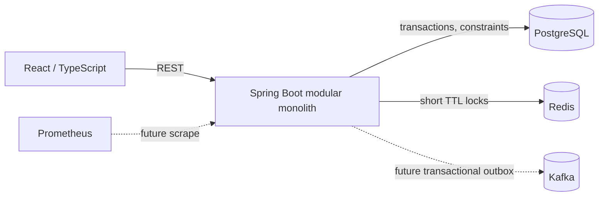
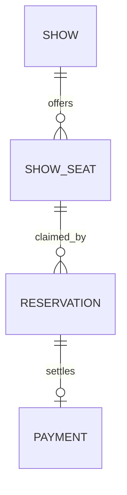

# Book Your Bomma

Book Your Bomma is a modular ticket-booking platform starter focused on the hard problem: preventing two customers from reserving the same seat. It uses a Spring Boot API, PostgreSQL as the source of truth, Redis for short-lived reservation coordination, and a React + TypeScript client.

## Run locally

Requirements: Docker Compose. From this directory:

```sh
docker compose up --build
```

Then open http://localhost:5173. The web app has separate sign-in, browse, seat selection, checkout, and booking-history pages. API documentation is at http://localhost:8080/swagger-ui.html.

## Deploy a preview on Render

The repository includes a `render.yaml` Blueprint for the frontend, API, PostgreSQL, and Redis-compatible Key Value service. To create the hosted preview, open [Render's Blueprint flow](https://dashboard.render.com/blueprints/new?repo=https%3A%2F%2Fgithub.com%2FYagnaPranith%2FBookyurBomma), connect GitHub if asked, select the repository, and apply the Blueprint. Render generates the JWT secret and wires the services together. Pushes to `main` trigger deployments.

The Blueprint uses free plans to avoid starting paid services. Render free web services can spin down after 15 minutes without traffic, free Key Value data is volatile, and a free PostgreSQL database expires after 30 days. This setup is for a preview; use paid persistent resources before relying on it for real bookings.

## Reservation consistency

The application uses two layers of protection. Redis `SET NX PX` locks serialize attempts across API instances, with unique lock tokens and compare-and-delete release. PostgreSQL then performs the authoritative transition under a transaction and a row lock. A unique constraint on `(show_id, seat_id)` for active reservations prevents a programming error or Redis outage from creating overlapping claims. Redis is an optimization and coordination layer; PostgreSQL constraints are the final guard. If Redis cannot be reached, reservation requests fail closed with 503.

Reservations expire after five minutes. The database records expiry and an expiration worker releases seats; Redis TTLs are only cleanup, not business state. Reservation requests use an `Idempotency-Key`; Redis serializes concurrent submissions for that key and retains the original response for 24 hours. Redis is required for this starter's idempotency cache, so treat it as an operational dependency until idempotency records move to a durable database table. Kafka is planned as an outbox-backed asynchronous integration; publishing directly inside a database transaction is deliberately avoided because it can lose or duplicate events.

## Current scope

This runnable slice provides email/password signup and login with BCrypt password hashes and expiring signed JWTs; Andhra Pradesh city and theatre selectors; 14 days of database-seeded shows with five three-hour slots per theatre per day; collision-safe shared seat availability; a simulated payment checkout; and a user's confirmed booking history. The theatre catalogue is sample data and should be replaced or maintained for a real deployment. Admin catalogue management, Kafka outbox consumers, rate limiting, observability dashboards, Kubernetes, and load-test reporting remain follow-on work. This starter is not production-hardened until those items and deployment-specific security configuration are complete.

## Architecture





## API

- `GET /api/v1/shows` — list seeded demo shows
- `GET /api/v1/shows/{showId}/seats` — current seat states
- `GET /api/v1/areas` — Andhra Pradesh city list
- `GET /api/v1/theatres?cityId=...` — theatres in a selected city
- `GET /api/v1/shows?theatreId=...&date=YYYY-MM-DD` — that day's shows
- `POST /api/v1/auth/signup` and `POST /api/v1/auth/login` — account creation and login
- `POST /api/v1/reservations` — reserve a set of seats (requires `Idempotency-Key`)
- `GET /api/v1/reservations/{id}` — inspect a reservation
- `DELETE /api/v1/reservations/{id}` — release a pending reservation
- `POST /api/v1/payments` — simulate SUCCESS, FAILED, or TIMEOUT and finalize/release seats
- `GET /api/v1/payments/{id}` — inspect a payment result
- `GET /api/v1/users/me/bookings` — signed-in user's confirmed bookings
- `GET /actuator/health` — health check

Reservation body: `{"showId":"...","seatIds":["...","..."]}`. A conflict returns 409; malformed input returns 400; missing Redis returns 503. All errors use Problem Details JSON.

Show start times are 09:00, 12:30, 16:00, 19:30, and 23:00 in Asia/Kolkata, each with a 180-minute duration. The 23:00 show ends at 02:00 the following day. Hold and booked states are returned by the same seat endpoint for every user; the client polls while the seat map is open.

## Engineering notes

- Data entities are not serialized directly; API records are explicit DTOs.
- PostgreSQL uses Flyway migrations; Hibernate schema mutation is disabled.
- Reservation requests are bounded (1–8 seats), validated, and capped by a 5-minute expiry.
- The demo seed is deterministic and safe to run repeatedly.
- Add auth before exposing reservation ownership endpoints publicly. Configure secrets through environment variables.

## Next increments

1. Authentication and admin-only catalog management.
2. Transactional outbox plus Kafka notification and analytics consumers.
3. Redis-backed rate limiting, cache invalidation, metrics and dashboards.
4. Testcontainers concurrency suite and Locust/JMeter load scenario. Record measured results only after running it against a declared environment.
5. Kubernetes manifests and deployment hardening.
